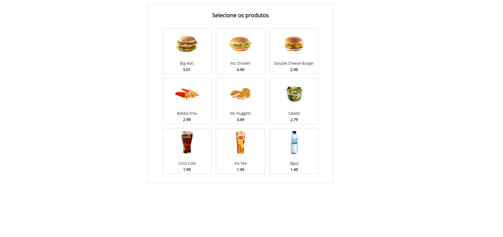
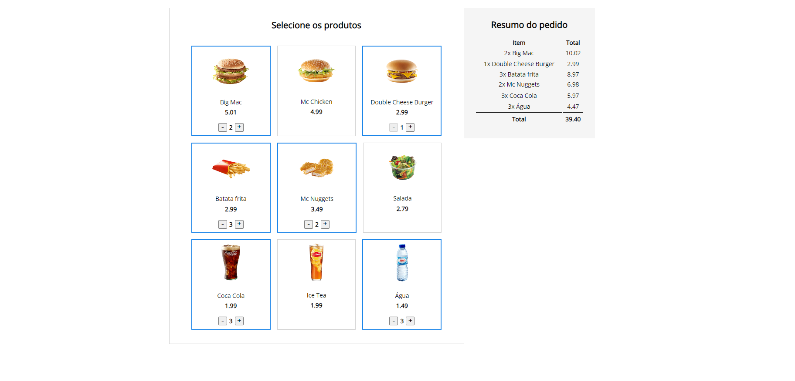

# Simple Self-Service Machine em Vue.js

- Implementação simples de *Self-Service Machine* para estudo de Vue.js com Javascript
- Vue inserido no projeto pelo CDN
- Os dados utilizados nesse projeto são fictícios e apenas para fins de estudo

## Descrição

- São mostrados os produtos, onde é possível seleciona-los e alterar as quantidades
- Ao selecionar o produto, ele é considerado ativo e lançado na nota a direita junto com a sua quantidade.
- Os valores de quantidade e totais são alterados dinamicamente conforme são alterados em cada produto.
- Segue abaixo screenshot das views:

 
 

